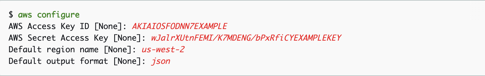

<h1 align="center">Terraform Tech Test</h1>


## Getting started

First off please clone this repo to your local machine:

```
$ git clone https://github.com/JoeJacques/terraform-test.git
```

From there you can open using your text editor of choice but before moving on there area few things to get through first.


### [Modules](modules)

Here you will find all of the `Terraform` modules that we have created. Feel free to have a look or even reuse them in some of your own projects.

## Some pre-requisites

 You will be required to build infrastructure using Amazon Web Services (AWS) so before getting started it would be recommended to create an AWS account. You can use the following link to get started:

[Get started with AWS](https://aws.amazon.com)

Select `Create an AWS Account` and add in all the required details. You will need to add in your card details as some AWS resources will be paid services. 

**Be aware that you must delete or destroy any infrastructure you create once completed to ensure you do not incur any more charges than are neccessary.**

## AWS Command Line Interface (CLI)

The AWS CLI will be used in a number of places so let's get that sorted to save some time before launching into anything.

AWS CLI version 2 installation instructions:

For information on the latest releases of AWS CLI version 2, see the [AWS CLI version 2 change notes](https://github.com/aws/aws-cli/blob/v2/CHANGELOG.rst) on GitHub.

### Linux
1. For the latest version of the AWS CLI, use the following command:

**`Linux x86 (64-bit)`**:
```
$ curl "https://awscli.amazonaws.com/awscli-exe-linux-x86_64.zip" -o "awscliv2.zip"
```
**`Linux ARM`**:
```
$ curl "https://awscli.amazonaws.com/awscli-exe-linux-aarch64.zip" -o "awscliv2.zip"
```

2. Unzip the installer. If your Linux distribution doesn't have a built-in unzip command, use an equivalent to unzip it. The following example command unzips the package and creates a directory named aws under the current directory.
```
$ unzip awscliv2.zip
```

3. Run the install program. The installation command uses a file named install in the newly unzipped aws directory. By default, the files are all installed to /usr/local/aws-cli, and a symbolic link is created in /usr/local/bin. The command includes sudo to grant write permissions to those directories.
```
$ sudo ./aws/install
```

4. Confirm the installation:
```
$ aws --version
```
### MacOS

1. For the latest version of the AWS CLI, use the following command block:
```
$ curl "https://awscli.amazonaws.com/AWSCLIV2.pkg" -o "AWSCLIV2.pkg"
aws-cli/2.1.22 Python/3.7.4 Linux/4.14.133-113.105.amzn2.x86_64 botocore/2.0.0
```

2. Run the standard macOS installer program, specifying the downloaded .pkg file as the source. Use the -pkg parameter to specify the name of the package to install, and the -target / parameter for which drive to install the package to. The files are installed to /usr/local/aws-cli, and a symlink is automatically created in /usr/local/bin. You must include sudo on the command to grant write permissions to those folders.
```
$ sudo installer -pkg ./AWSCLIV2.pkg -target /
```

3. Confirm the installation:
```
$ aws --version
aws-cli/2.1.22 Python/3.7.4 Darwin/18.7.0 botocore/2.0.0
```

### Windows

1. Download the AWS CLI MSI installer for Windows (64-bit):

    * For the latest version of the AWS CLI: https://awscli.amazonaws.com/AWSCLIV2.msi

2. Run the downloaded MSI installer and follow the on-screen instructions. By default, the AWS CLI installs to C:\Program Files\Amazon\AWSCLIV2.

3. To confirm the installation, open the Start menu, search for cmd to open a command prompt window, and at the command prompt use the aws --version command.

## Set and view user configuration settings

When using AWS services through Terraform you will need to provide user credentials for AWS. In order to do this we can use the AWS CLI to store these.

First of all, it is not best practice to use your AWS root user access key as this provides full access to `all resources` for `all services`. Instead we want to create a new user and give that user the access we need. 

To do this navigate to the `services` menu at the top left of your console. in the search bar type in `IAM` to bring up the `Identity and Access Management` dashboard. Down the lefthand side click on `Users` and then `Add user`:


Add in your user's name and select `programmatic access`, which will give your user access to create the required resources but not access your management console:


Click `Next: Permissions` and then we want to `Attach existing policies directly`. At the top of that list tick the box for `AdministratorAccess` providing your user with full access to AWS services and resources.


Click `Next: Tags` and add any tags you wish to give your user and click `Next: Review`. You should see all details here and if you see the correct name and access type as programmatic access, you are good to go; hit `Create user`.

You will only be shown the `Access Key ID` and `Secret access key` once so be sure to download the .csv file or make a note of them (but keep that secure!). To make life easier let's add these credentials to your AWS credentials file now using the AWS CLI.

Within your terminal type:
```
$ aws configure
```
This will then prompt you to input the following:

* `AWS Access Key ID` - paste your `Access Key ID` in here
* `AWS Secret Access Key` - paste your `Secret Access Key` in here
* `Default region name` - your default AWS region (e.g. eu-west-1 for Ireland). However, you can leave this blank if you like as we will specify the correct region where appropriate.
* `Default output format` - specifies how the results are formatted. However, you can leave this blank as well but for reference you could use json, yaml, yaml-stream, text or table. Default is json.

Example:


Once you hit enter these credentials will be saved within your `.aws` folder, within your root directory, as your default profile. Terraform will look in here and use these credentials to access your account and build what it needs.


## Install Terraform

Before we deploy the infrastructure you will need to install Terraform on your local machine. Please [visit the Hashicorp website](https://learn.hashicorp.com/tutorials/terraform/install-cli) for how to do this.


## Build Enviroment


```
$ terraform init
```

This will initialise a working directory containing our Terraform configuration files. This command is always safe to run multiple times, to bring the working directory up to date with changes in the configuration. You should see the following
<p align="center">

</p>

```
$ terraform plan
```

This command is used to create an execution plan. Terraform performs a refresh, unless explicitly disabled, and then determines what actions are necessary to achieve the desired state specified in the configuration files.

This command is a convenient way to check whether the execution plan for a set of changes matches your expectations without making any changes to real resources or to the state. For example, terraform plan might be run before committing a change to version control, to create confidence that it will behave as expected. The plan will be fairly long but if all went well you should see the following in your terminal:

<p align="center">

</p>


```
$ terraform apply
```

This command is used to apply the changes required to reach the desired state of the configuration, or the pre-determined set of actions generated by a terraform plan execution plan. You will be prompted to enter a value to perform the action. Type `yes` as the value and hit enter.

Terraform will now build the required AWS infrastructure. This should complete after a minute or so.

Once the apply is complete all your inferstrcture should be created in AWS.